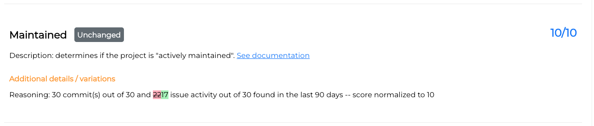
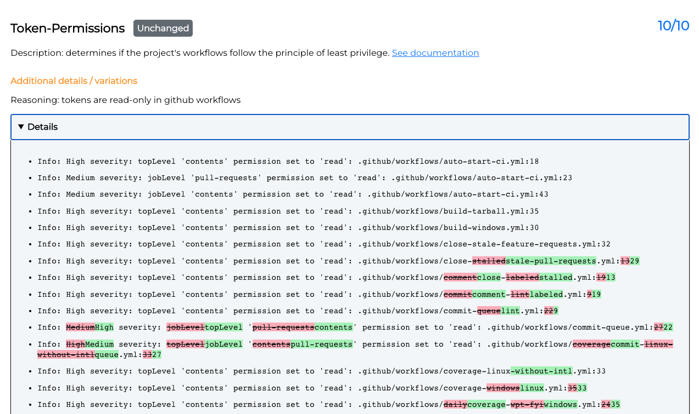
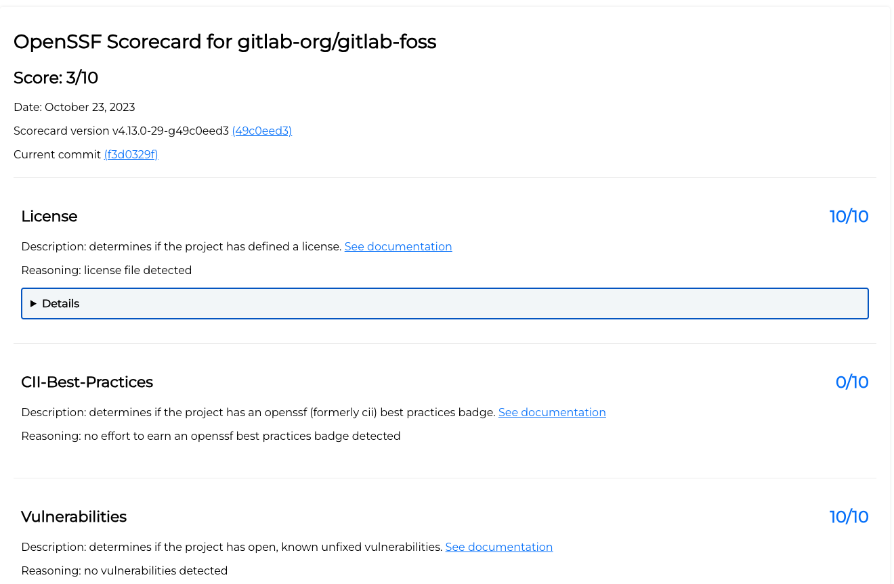

# openssf-scorecard-api-visualizer

The OpenSSF Scorecard Monitor Visualizer is a tool that provides a visual representation of the OpenSSF Scorecard data for monitoring the security status of open source projects. It fetches the scorecard data from the [OpenSSF Scorecard API](https://api.securityscorecards.dev/#/results) and presents it in a user-friendly and interactive visual format.

The Visualizer is part of the [OpenSSF Scorecard Monitor](https://github.com/UlisesGascon/openssf-scorecard-monitor), where you can access to the features.

## Features

**Scorecard Data Visualizer:** Display the OpenSSF Scorecard data in a visual format for easy understanding and analysis.

 
    

        
    

 

**Scorecard Data Comparator:** Compare between two commits that reported Scorecard data. See how the scores changed and further details.

 
    

        
    

 

**Scorecard Data Comparator Diff:** Makes easier the visualization of the differences in the Scorecard comparator reasoning and details.

 
    

        
    

        

        
    

 

**Support to GitLab repositories:** The project provides support of visualization and diff comparation for GitLab projects. In the GitLab version, deps.dev and step security links are not included, as those platforms don't support GitLab projects yet.

 
    

        
    

 

## How to use it

The Visualizer and the Comparator can be used outside the Monitor.

You have 3 options of visualization. Depending on which one you want to check, you should craft your own url as:

- Checks the latest Scorecard data available for a project: `https://kooltheba.github.io/openssf-scorecard-api-visualizer/#/projects/${platform}/${org}/${repo}`
- Checks the Scorecard data for an specific commit (previously reported): `https://kooltheba.github.io/openssf-scorecard-api-visualizer/#/projects/${platform}/${org}/${repo}/commit/{commitHash}`
- Compares two specific commits, previously reported: `https://kooltheba.github.io/openssf-scorecard-api-visualizer/#/projects/github.com/nodejs/node/compare/{prevCommitHash}/{currentCommitHash}`

> 👉 Please note that in order to retrieve data from the Scorecard API, it is necessary for organizations or repository owners to report their commits to the Scorecard. However, it's important to keep in mind that not all organizations report their commits, which may result in a `404 error` if the data is not available in the API. Please be aware that this behavior is expected and not indicative of a bug.

### Examples

- [Nodejs latest repository Scorecard](https://kooltheba.github.io/openssf-scorecard-api-visualizer/#/projects/github.com/nodejs/node)
- [Nodejs specific commit Scorecard](https://kooltheba.github.io/openssf-scorecard-api-visualizer/#/projects/github.com/nodejs/node/commit/da80964a3d708ef3ae42d4424034f155ad37e07d)
- [Nodejs reported commits comparation](https://kooltheba.github.io/openssf-scorecard-api-visualizer/#/projects/github.com/nodejs/node/compare/2ac5e9889aba461f5a54d320973d2574980d206b/da80964a3d708ef3ae42d4424034f155ad37e07d)

## Contributing

Contributions are welcome! If you would like to contribute to the OpenSSF Scorecard Monitor Visualizer project, please follow these steps:

1. Fork the repository.
2. Create a new branch for your feature or bug fix.
3. Make your changes and ensure that the code is properly formatted.
4. Write tests to cover your changes if applicable.
5. Commit your changes and push them to your forked repository.
6. Submit a pull request to the main repository, explaining your changes and providing any relevant details.

## License

This project is licensed under the [Apache License Version 2.0](LICENSE).

## Support

If you encounter any issues or have questions about the OpenSSF Scorecard Monitor Visualizer, please [open an issue](https://github.com/KoolTheba/openssf-scorecard-api-visualizer/issues/new) on the GitHub repository.
